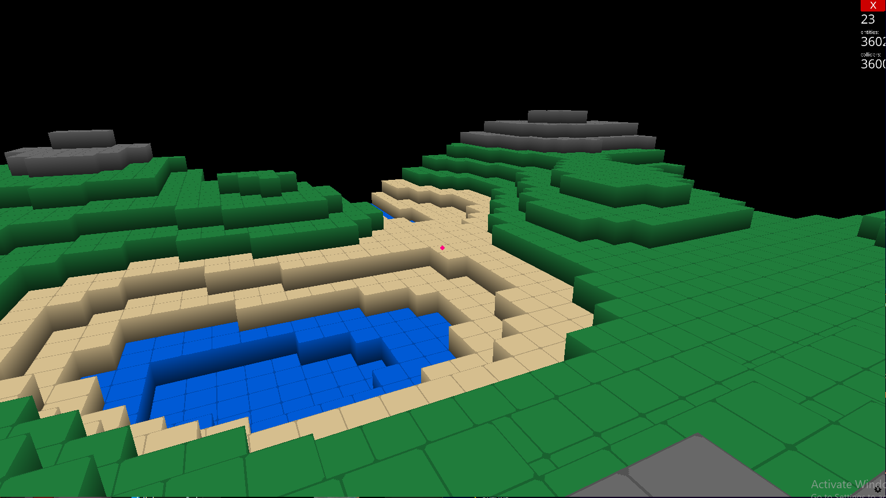

# Voxel-Engine-Python
Created a voxel engine in Python that dynamically renders a voxel environment based on player’s position. Utilized the Ursina library to create voxel meshes as well as optimize those meshes.

#Screenshots

